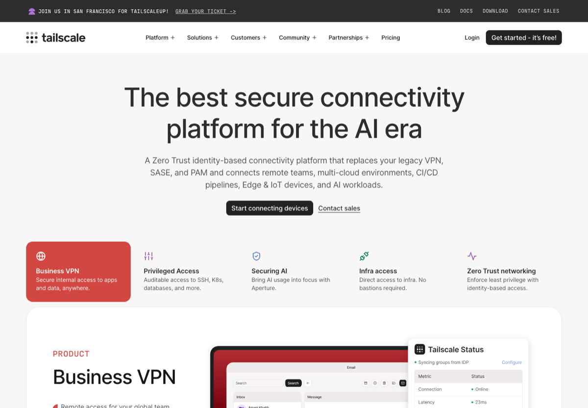

# 远程开发、服务器与内网穿透

> 整理 SSH、远程编辑、文件同步、隧道、终端复用和跨设备组网工具。

  
  
  

图片来源：公开入口预览图，[https://tailscale.com/](https://tailscale.com/)，截取/整理日期：2026-07-02。

## 定位

本仓库是一份面向中文用户的主题索引，重点整理常用、稳定、值得优先了解的工具入口，并补充适用场景、选型建议和风险边界。目标不是追求数量，而是降低第一次检索和筛选的成本。

- **主题**：开发 / 服务器
- **适合人群**：学生服务器、实验室 GPU、远程办公和个人服务部署用户
- **首批重点**：VS Code Remote SSH / Tailscale / Cloudflare Tunnel / ngrok / tmux
- **为什么值得整理**：远程服务器、文件同步和端口转发是学生开发者与实验室环境中的高频基础需求。

## 使用方式

1. 先看 [精选资源](#精选资源)，按自己的场景挑 2-3 个入口试用。
2. 再看 [选型建议](#选型建议)，避免一上来把同类工具全装一遍。
3. 如果用于课程、论文、开源项目或生产环境，务必看 [风险提醒](#风险提醒)。

## 收录口径

围绕 SSH、弱网、文件同步、隧道、远程编辑、长任务六个真实痛点。

优先收录：

- 官方文档、官网、活跃 GitHub 仓库；
- 免费可试用或开源项目；
- 中文用户高频搜索、收藏、复用的工具；
- 入口稳定、说明清楚、维护状态可判断的资源。

暂不收录：

- 破解软件、灰色下载、账号代认证、返利推广；
- 长期不可访问或入口频繁变化的镜像；
- 只有营销话术、没有清晰文档的产品；
- 与本主题关系很弱的泛泛工具。

## 精选资源

| 名称 | 适合场景 | 入口 |
| --- | --- | --- |
| VS Code Remote SSH | VS Code 远程开发官方文档。 | [访问](https://code.visualstudio.com/docs/remote/ssh) |
| Tailscale | 基于 WireGuard 的组网工具。 | [访问](https://tailscale.com/) |
| Cloudflare Tunnel | 无需公网 IP 的隧道方案。 | [访问](https://developers.cloudflare.com/cloudflare-one/connections/connect-networks/) |
| ngrok | 本地服务公网暴露工具。 | [访问](https://ngrok.com/) |
| tmux | 终端会话复用。 | [访问](https://github.com/tmux/tmux) |
| mosh | 弱网下更稳的远程 shell。 | [访问](https://mosh.org/) |
| rsync | 增量文件同步。 | [访问](https://rsync.samba.org/) |
| rclone | 云盘和远程存储同步工具。 | [访问](https://rclone.org/) |
| Dev Containers | 可复现开发容器规范。 | [访问](https://containers.dev/) |
| NetBird | 开源 WireGuard 组网平台。 | [访问](https://netbird.io/) |
| frp | 内网穿透工具。 | [访问](https://github.com/fatedier/frp) |
| Syncthing | 跨设备文件同步。 | [访问](https://syncthing.net/) |

## 选型建议

- 先保证 SSH key 登录稳定。
- 长任务必须用 tmux。
- 跨网络访问优先考虑 Tailscale 或 Cloudflare Tunnel。

## 风险提醒

- 避免将服务端口直接暴露到公网。
- 私钥不得上传到服务器、网盘或公共仓库。

## 维护说明

- 本仓库会优先更新失效链接、官方入口变更和明显过时的描述。
- 新增资源请尽量给出官网、GitHub 仓库、文档页或可验证的公开说明。
- 推荐新资源时，请说明具体场景和选择理由，避免只写泛泛评价。

## 数据文件

结构化数据见 [`data/links.json`](data/links.json)，可用于脚本生成网页、表格或个人导航页。

## Contributing

欢迎提交 PR 修正链接、补充官方文档、更新截图或改进中文说明。请保持描述短、准、可验证。

## License

MIT。第三方商标、截图、网页内容和产品名称归各自权利方所有，本仓库只做索引和学习整理。
